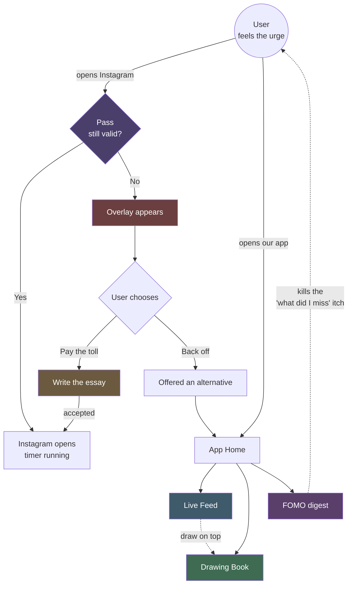
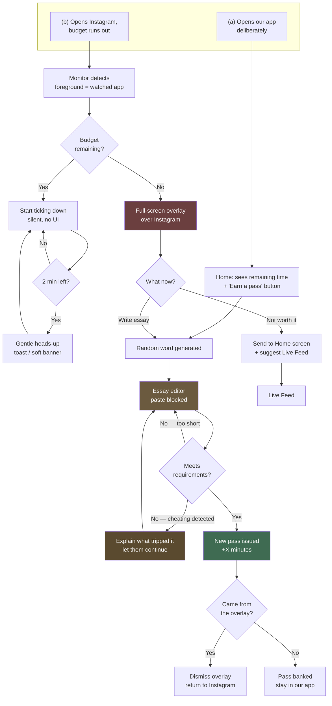
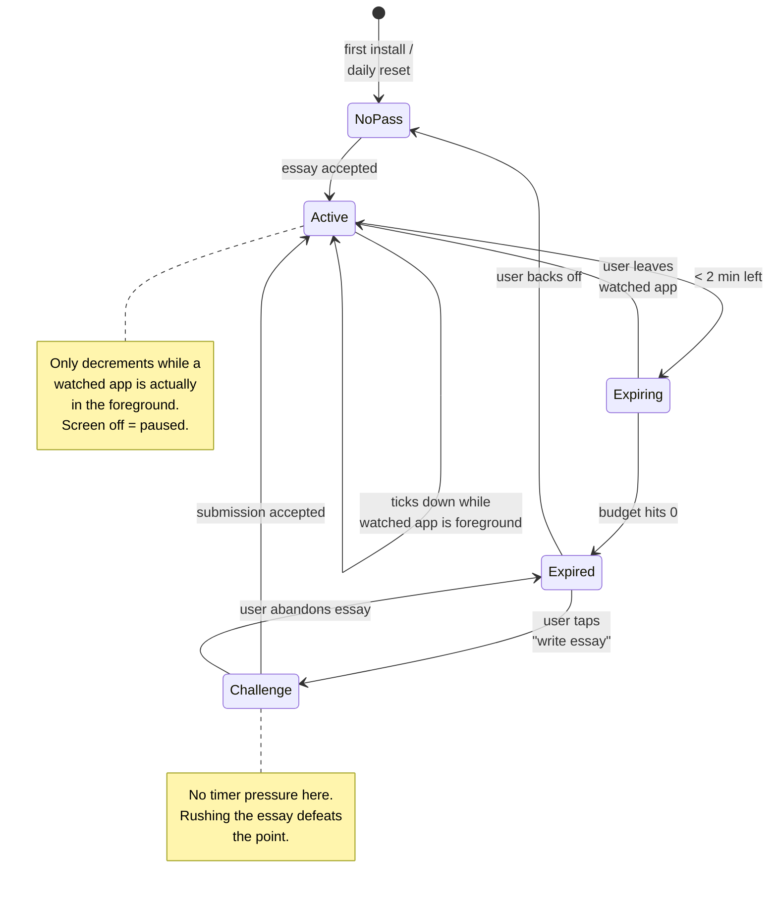
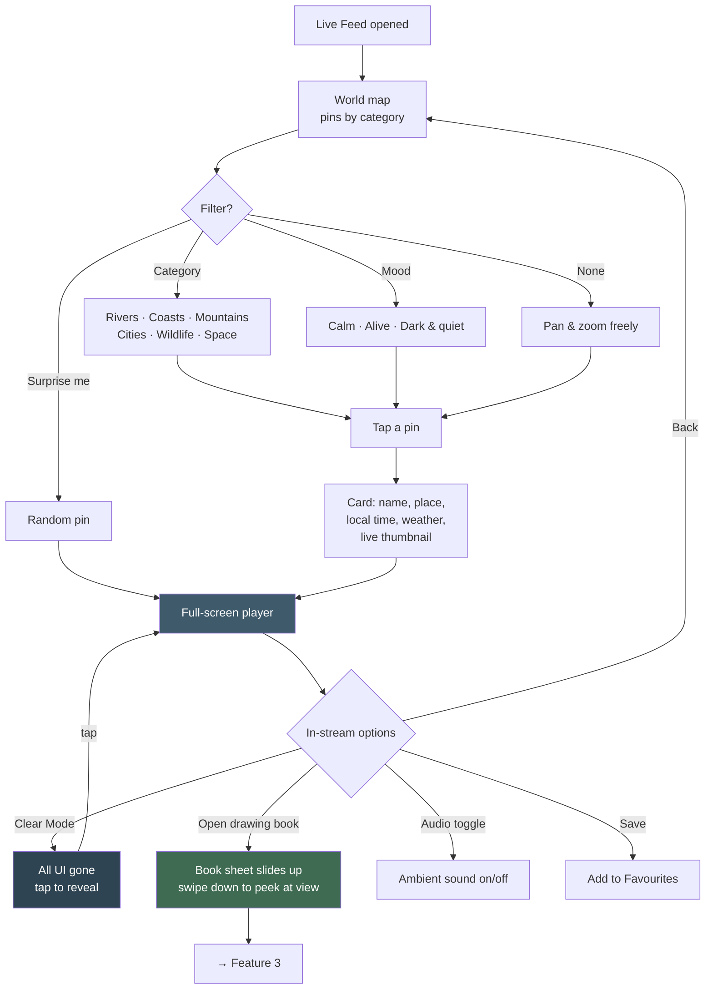
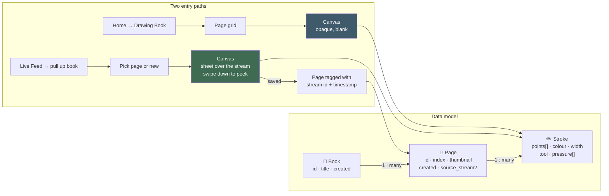
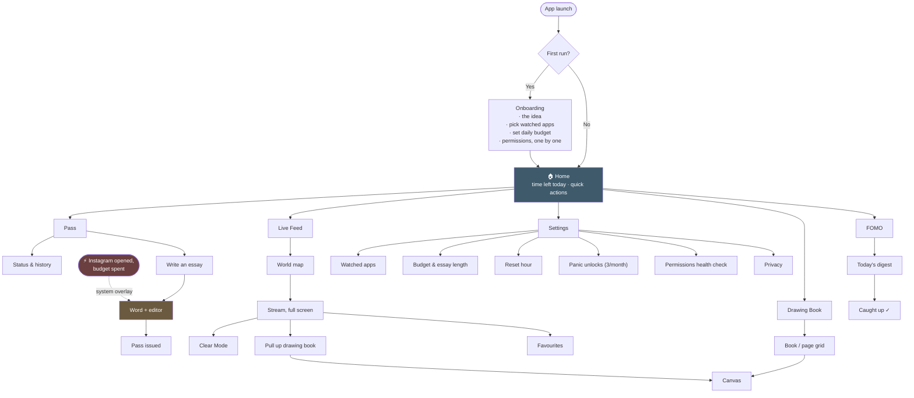
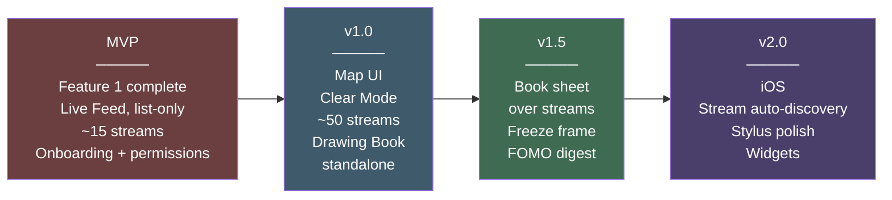

# App Plan

> **this file** — *what* we're building · [`tech_stack.md`](./tech_stack.md) — *what with* · [`design_theme.md`](./design_theme.md) — *what it looks like* · [`roadmap_plan.md`](./roadmap_plan.md) — *in what order*
> **Status:** Idea / pre-build specification
> **Platform:** Android first, iOS in a later phase
> **Last updated:** 2026-07-27

---

## 1. Overview

### The thesis

Most screen-time apps try to **stop** you. They put up a wall, you tap "ignore for 15 minutes," and the wall stops meaning anything by day three. The wall fails because ignoring it is cheaper than obeying it.

This app does two things differently:

1. **It charges a real price instead of saying no.** You can always get back into Instagram — but the toll is writing an essay by hand, on a word you didn't choose, with no paste and no shortcuts. Nothing is forbidden. It's just expensive enough that the reflex-open dies, and only the deliberate open survives.
2. **It gives the urge somewhere else to go.** Blocking a habit leaves a hole. So the app also holds a calm, slow, *live* place to be — a river somewhere in the world, streaming right now — and a drawing book you can pull up over it.

The reflex isn't really a craving for Instagram. It's a craving for *somewhere to put your attention for a minute.* This app answers that craving with something that doesn't cost you an hour.

### Who it's for

People who open Instagram without deciding to. ADHD brains, compulsive scrollers, anyone who has closed the app and reopened it in the same motion. The author included.

### The guiding principle

> **Friction over prohibition.**
> Never say "no." Say "yes, and here's what it costs."

Corollary: the toll must be **honest work** — real, non-trivial, non-automatable, and not busywork you can zone out through. Writing prose about a random word qualifies. Tapping "I'm sure" fifteen times does not.

### The four features

| # | Feature | One-line purpose |
|---|---------|------------------|
| 1 | **The Pass** | Time budget for social apps; renewed only by writing an essay |
| 2 | **Live Feed** | Full-screen live streams of real places, chosen from a world map |
| 3 | **Drawing Book** | Multi-page sketchbook, standalone or pulled up over a live stream |
| 4 | **FOMO** | A finite daily digest of what's trending, so quitting doesn't feel like falling behind |

### Anti-goals — what this app is deliberately *not*

- **Not a productivity tracker.** No streaks, no productivity score, no weekly shame report. Guilt metrics are just another feed.
- **Not another feed.** Nothing in this app scrolls forever. Every surface has a bottom.
- **Not a parental control.** The user is the one installing it on themselves. There is no authority figure, and the tone should never be scolding.
- **Not gamified.** No points, no badges, no leaderboard. The reward for writing the essay is the thing you wanted; that's enough.
- **Not a social network.** No accounts, no sharing to a timeline, no followers. Your essays and drawings are yours and stay on your device.

### How the four features relate



**Feature 1 is the wall. Features 2–4 are the doors next to it.** That relationship is the whole product — a wall with no door is a wall people uninstall.

---

## 2. Feature 1 — The Pass

### 2.1 The core idea

You get **X minutes per day** across your watched social apps. That's your pass. When the minutes run out, the pass is spent.

To get a new pass, you write an essay:
- On a **randomly generated word** you don't get to choose
- Of at least **N words**
- **Typed by hand.** Paste is disabled. No dictation. No autofill.

Submit it, and a new pass is issued. Want a third pass? Write another essay.

There is no "skip," no "just 5 more minutes," and no way to buy your way out. The only currency is effort.

### 2.2 The two entry points

This is important and easy to get wrong. The gate can be reached **two ways**, and they should feel like the same system:

**(a) Deliberate — the user opens our app**
They come to us. They see their remaining time, and they can start an essay proactively to bank a pass for later. Calm, no pressure, no interruption.

**(b) Reactive — the user over-uses a watched app**
They're inside Instagram. Their time runs out. An overlay slides up over Instagram itself. This is the interruption path, and it needs to be *fast* — if there's a two-second lag, they've already scrolled past three reels and the moment is lost.



### 2.3 Pass states



### 2.4 The essay challenge — mechanics

| Parameter | Default | Notes |
|-----------|---------|-------|
| Daily free budget | 30 min | User-set at onboarding; can be lowered any time, raising takes effect **tomorrow** |
| Pass grant per essay | 15 min | Deliberately less than the free daily budget |
| Essay length | 150 words | User-set floor of 50; no upper cap on what they write |
| Word source | Curated list (~2,000 concrete nouns + abstract concepts) | Concrete words are easier to write about; abstract ones are more interesting. Mix both. |
| Time limit | **None** | A timer would encourage garbage typing. The cost is effort, not speed. |
| Paste | Blocked | See anti-cheat below |
| Minimum unique words | 40% of total | Cheap guard against `word word word word...` |

**Why a random word?** Because if you pick the topic, you'll pick the same easy topic every time and have a canned paragraph memorised by week two. Randomness keeps the cost from decaying.

**Prompt framing.** The word appears with a soft prompt, not an exam question:

> **LIGHTHOUSE**
> Write 150 words. Anything you like — a memory, a story, why you hate the word, what it makes you think of. Nobody reads this but you.

That last line matters. It removes performance anxiety, which is otherwise the reason people abandon the essay and just uninstall the app.

**What counts as valid:**
- Meets the word count
- Meets the unique-word ratio
- Was typed, not inserted
- Contains sentence-like structure (has spaces, isn't one 800-character token)

**What we deliberately do NOT check:** quality, relevance to the word, grammar, spelling. See §7.3 — this is a real open question, but the default answer is *don't grade it*. The moment we grade quality, we have to define quality, and we've turned a wellbeing app into a hostile teacher.

### 2.5 Anti-cheat — and its honest limits

The essay is only a real toll if it can't be faked in three seconds. Layered defences, in order of how much they actually help:

| Defence | How | Effectiveness |
|---------|-----|---------------|
| **Disable paste** | Custom `EditText` / Compose text field with the paste action stripped from the selection toolbar and `onReceiveContent` rejecting non-typed input | **High** — kills the obvious attack |
| **Bulk-insert detection** | Reject any single text-change event that adds more than ~15 characters at once | **High** — catches paste routes we didn't anticipate, plus most macro tools |
| **Block keyboard suggestion spam** | `InputType` flags disabling suggestions + autocomplete | **Medium** — a determined user switches keyboards |
| **Typing cadence check** | Flag statistically impossible rhythms (perfectly uniform inter-key intervals = a script) | **Medium** — catches automation, not a fast human typist |
| **Reject dictation** | Detect input from speech IMEs | **Low–Medium** — easy to work around, and arguably an accessibility problem to block. See note. |
| **Unique-word ratio** | 40% floor | **Medium** — stops keyboard-mashing, not a determined copyist |

**The honest bit:** none of this stops someone who genuinely wants to defeat it. They can retype an essay from another screen. They can revoke usage access in Settings. They can uninstall the app in ten seconds.

**And that's fine.** The target isn't the adversary — it's the *reflex*. Every one of those workarounds requires a deliberate, conscious decision, and a deliberate decision to use Instagram is exactly what this app is trying to produce. If someone consciously chooses to bypass it, the app has already done its job.

Design consequence: **never make the app feel like an opponent.** No "NICE TRY 😏" messages. If cheating is detected, say it flatly and let them keep typing:

> That looked like pasted text, so it wasn't counted. Keep going.

**Accessibility note:** blocking dictation harms users who rely on it. Recommendation — offer a per-user "I use dictation" setting during onboarding that swaps the dictation block for a longer word requirement instead. Don't lock out disabled users to catch a cheater who has easier options anyway.

### 2.6 Edge cases

| Situation | Behaviour |
|-----------|-----------|
| **Phone reboots** | Service restarts via `BOOT_COMPLETED`; remaining budget persisted, restored exactly. No free reset. |
| **Midnight rollover** | Budget resets at a **user-chosen hour** (default 4am, not midnight — someone scrolling at 11:58pm shouldn't get a gift at 00:00). |
| **App force-stopped** | Watchdog via `WorkManager` periodic check re-arms the service. Detectable but not fully preventable; log it and gently mention it in-app. |
| **Uninstalled to reset** | Not preventable without device-admin. Not worth it — see §6.6, risk 3. Optionally offer opt-in "hard mode" using device admin for users who want it. |
| **Multiple watched apps** | **One shared budget** by default. Instagram → TikTok → Reddit shouldn't be a way to get 3× the time. Per-app budgets available as an advanced setting. |
| **Screen turns off mid-session** | Timer pauses immediately. Pocket time is not scroll time. |
| **Notification pulls user into Instagram** | Pass check still applies. Optionally offer "notification grace" — 60 seconds to read a DM without spending a pass. |
| **Genuine emergency** | **Panic unlock**: 3 uses per month, instant, no essay, no questions. Ask nothing. A wellbeing app that traps someone in a real emergency is a bad app. Uses reset monthly and are shown in settings without judgement. |
| **Airplane mode / offline** | Everything in Feature 1 works fully offline. Word list ships with the app. |
| **User lowers vs raises budget** | Lowering: immediate. Raising: takes effect at the next reset. Prevents impulse-raising mid-craving. |

### 2.7 Technical notes (Android)

**Detecting which app is in the foreground — decided: `UsageStatsManager` only.**

This is the standard, unrestricted API for exactly this job — the one behind the "Usage access" screen in Android Settings, and the one every screen-time app in the Play Store is built on. Permission is `PACKAGE_USAGE_STATS`, granted by sending the user to a Settings screen (it is not a runtime dialog — there's a one-time hand-off to `ACTION_USAGE_ACCESS_SETTINGS` and back).

**How it works.** `queryEvents()` returns a stream of `ACTIVITY_RESUMED` / `ACTIVITY_PAUSED` events per package. Poll it from the foreground service, watch for a resume on a watched package, start the timer. Watch for the pause, stop it.

**Adaptive polling — this is what makes the lag a non-issue.** The naive approach polls at a fixed interval and trades battery against responsiveness. Don't do that. You only need *fast* detection when the wall is armed:

| Budget remaining | Poll interval | Why |
|---|---|---|
| Plenty (> 5 min) | 5–10 s | Just accumulating time. A few seconds of imprecision in a 30-minute budget is irrelevant. |
| Nearly spent (< 5 min) | 2 s | Getting ready to fire. |
| **Zero — wall armed** | **1 s** | Needs to land before they're absorbed. |
| Screen off / no watched app in foreground | Paused entirely | Zero battery cost. |

Net result: the wall appears in about a second in the case that matters, and the service costs almost nothing the rest of the time. The often-quoted "usage stats is too slow to block with" complaint comes from apps polling at a lazy fixed interval.

**One caveat to test early:** `UsageStatsManager` event delivery has some reporting lag of its own on certain OEM builds, independent of your poll rate. Measure it on a real device (especially a Xiaomi/Oppo) before assuming 1 second.

**Explicitly not using `AccessibilityService`.** It would give instant callbacks instead of polling, but it's the permission Google Play polices hardest — it's what spyware and banking malware abuse, so it requires a Play Console declaration and reviewers reject inconsistently. The gain is a second or two of latency that adaptive polling largely recovers anyway. Not worth putting the app's ability to ship at risk. **This also means the app's permission set no longer looks like spyware**, which makes onboarding meaningfully easier to write.

**Showing the overlay.** Must be a `SYSTEM_ALERT_WINDOW` overlay, **not** a launched Activity. Since Android 10, apps cannot start activities from the background, so `startActivity()` from a service will silently fail. Draw a `TYPE_APPLICATION_OVERLAY` window instead.

**Staying alive.** Foreground service with a persistent (low-priority, minimal) notification, plus a request for battery-optimisation exemption. Aggressive OEM battery managers (Xiaomi, Oppo, Samsung) will still kill it — ship a per-OEM "keep me running" instructions screen, since this is the #1 cause of "the app stopped working" reviews for every app in this category.

**Persistence.** Room for essay history and pass ledger; DataStore for settings. All local.

> ### ⚠️ Now the biggest risk in the app: OEM battery killers
>
> With accessibility dropped, store policy is no longer the main threat — **keeping the monitor alive is.**
>
> Xiaomi (MIUI/HyperOS), Oppo/Realme (ColorOS), Vivo (Funtouch), and Samsung (with adaptive battery on) all aggressively kill background and foreground services, regardless of what Android's own rules say. When they do, the Pass silently stops working: no wall appears, no error, no indication anything is wrong. The user just thinks the app is broken — and it is.
>
> This is the number one negative-review driver for every app in this category, and it is a much more likely cause of failure than anything Google Play does.
>
> **Mitigations:**
> - Request battery-optimisation exemption during onboarding, with **per-OEM instructions** (the setting is buried in a different place on every brand — `dontkillmyapp.com` documents them all)
> - `WorkManager` periodic watchdog that re-arms the service if it finds it dead
> - **Self-diagnosis:** the app should notice its own gaps. If the service was killed, say so on next open — *"Looks like your phone stopped this app in the background. Here's how to fix it."* Silent failure is what generates the one-star review; visible failure with a fix generates a settings change.
> - Test on a physical Xiaomi or Oppo device before launch. An emulator will not reproduce this.

---

## 3. Feature 2 — Live Feed

### 3.1 The idea

A world map. Pins on it. Each pin is a **live stream running right now** — a river in Norway, a street corner in Tokyo, a watering hole in Namibia, a harbour in Maine, the Earth from the ISS.

Tap a pin, and it goes **full screen**. No comments. No like button. No next video. No recommendations. Just the place, as it is, right now.

The pitch to the user: *you wanted to look at something. Look at this instead.* And crucially — **it doesn't cost a pass.** This is the alternative, not another thing being rationed.

### 3.2 Why live, specifically

Not recorded nature footage — **live**. The difference is the whole point:

- It's genuinely happening. That's a different feeling from watching a file.
- Nothing is edited for retention. No cuts every 1.4 seconds, no music swell, no hook. Your nervous system gets to come down.
- It has no ending, so there's no "next episode" pull. You leave when you're done, not when it's done.
- It's *somewhere else*. Time zones, weather, and darkness are real. Sitting with a Norwegian river at 3am their time is a small, quiet kind of travel.

### 3.3 User flow



### 3.4 Clear Mode

The signature interaction. Everything disappears — status bar, navigation, player controls, the stream title, everything. Full immersive mode. Only the view remains.

- One tap anywhere brings controls back for 3 seconds, then they fade again
- Screen stays awake (`FLAG_KEEP_SCREEN_ON`) while active
- Optional auto-dim after 10 minutes to save battery, waking on touch
- Optional sleep timer (15 / 30 / 60 min / off) so it doesn't run all night
- Entering Clear Mode should have a slow fade, not a snap. The transition is part of the calming.

### 3.5 Does Live Feed consume the Pass?

**No. Recommendation: it must be free and unlimited.**

The whole architecture of the app is: expensive door on one side, open door on the other. If Live Feed is also rationed, the app is just a punishment box, and the user uninstalls it. There is no version of "watching a river for 40 minutes" that needs to be prevented.

*(Optional, opt-in: a "you've been here two hours" gentle check-in. Not a block — a note. Off by default.)*

### 3.6 The curated stream registry

Streams are hand-picked and hand-tagged. Quality over quantity — **~50 excellent streams at launch** beats 500 unreliable ones.

Schema per entry:

```json
{
  "id": "no-lofoten-harbour",
  "title": "Lofoten Harbour",
  "place": "Reine, Norway",
  "lat": 67.9333,
  "lng": 13.0833,
  "category": "coast",
  "mood": ["calm", "dark-and-quiet"],
  "source": "youtube",
  "embed_type": "youtube_iframe",
  "stream_id": "XXXXXXXXXXX",
  "has_audio": true,
  "audio_type": "ambient",
  "timezone": "Europe/Oslo",
  "last_verified": "2026-07-27",
  "attribution": "Channel Name"
}
```

**`last_verified`** is the field that matters most in practice — streams die constantly. Channels go offline, cameras break, links rot.

**Health checking.** A scheduled server-side job pings every stream daily and flags dead ones. The registry ships as a **remote JSON file fetched and cached by the client**, so a dead stream can be swapped without an app update. Bundle a fallback copy in the APK so the map works offline / on first launch.

**Good source families to curate from:** explore.org (excellent, permissive, wildlife-heavy), EarthCam, Skyline Webcams, NASA/ISS live, national park services, harbour and airport cams, university weather cams.

### 3.7 Technical notes

**Map.** **MapLibre GL Native** with OpenStreetMap or free vector tiles (Protomaps / MapTiler free tier). Rationale: no per-load billing, no API key in the client, and full styling control — which matters, because the map should look **calm and dark**, not like a navigation app. Google Maps SDK is the fallback if custom styling proves painful, but its cost model scales badly for a free app.

**Playback — two separate paths:**

| Source type | Player | Notes |
|---|---|---|
| Direct HLS/DASH webcams | **Media3 / ExoPlayer** | Native, efficient, fully controllable, can be composited under other views |
| YouTube live streams | **Official IFrame player** (via `android-youtube-player` WebView wrapper) | Required by YouTube ToS |

**Why not just extract YouTube's HLS URL?** Because that violates YouTube's Terms of Service, breaks whenever they change their internals, and is a straightforward path to a takedown. Use the IFrame player for YouTube content.

**Note on the drawing book over streams.** An earlier draft had the drawing canvas rendered *translucent* on top of the video so you could trace the scene. That collided with YouTube's Terms of Service, which prohibit obscuring or overlaying the embedded player. **Design decision: the book is now an opaque sheet that slides up over the stream** (see §4.5) rather than a see-through layer. This sidesteps the ToS question entirely and works identically on every stream regardless of source — no per-stream capability flags, no "this feature isn't available here" messages.

*(Door left open: true translucent tracing is legally fine on direct-HLS webcam sources, which aren't governed by YouTube's terms. If tracing turns out to be missed, it can return later as a capability limited to those streams. Not in scope now.)*

**Bandwidth.** Live video is expensive. Ship a quality selector, default to "auto," and warn on mobile data. Add a data-saver mode that caps resolution.

**Playback while the sheet is up.** The stream keeps playing behind the book sheet. Don't pause it — the point of swiping the sheet down is to glance at a *live* view, and pausing would break that. Do drop video quality while it's hidden to save bandwidth.

---

## 4. Feature 3 — The Drawing Book

### 4.1 The idea

A drawing book, like the kind a child has. Not a design tool — a **book**. It has pages. You flip through them. You draw whatever you want, badly, and nobody sees it.

Two ways in:

1. **Standalone** — open the book, make a new page, draw. Blank paper.
2. **Over a live stream** — while watching the Lofoten harbour, pull your book up over it. The book covers the screen and you draw; **swipe it down whenever you want to look at the harbour again**, then swipe it back up and keep going. Draw the place while you're sitting with it.

The second one is the idea that makes this app specific rather than generic.

### 4.2 Why it's here

The urge to scroll is often just an urge to do *something* with your hands and eyes. Drawing consumes exactly that impulse, but produces something instead of consuming something. It's absorbing without being extractive.

And a drawing made while sitting with a live view is a genuinely lovely thing to have: not a screenshot, not a filter — something you sat and drew, of a real place, at a real moment. Datestamped and located, it becomes a kind of diary.

### 4.3 Data model & entry paths



### 4.4 Tools

Kept deliberately small. This is a sketchbook, not Procreate — a huge toolbar is its own kind of overwhelm.

| Tool | Behaviour |
|------|-----------|
| **Pencil** | Thin, slightly textured, pressure-sensitive |
| **Pen** | Solid, even weight |
| **Marker** | Thick, semi-transparent, layers when overlapped |
| **Eraser** | Stroke-aware (removes whole strokes) or pixel-wise — offer both |
| **Colour** | ~16 curated swatches + a full picker. Curated palette should be pleasant by default, so a random pick still looks decent |
| **Size** | Simple slider |
| **Undo / Redo** | Unlimited within a session, persisted per page |
| **Pan / zoom** | Two-finger; drawing stays one-finger |

Deliberately **excluded from v1:** layers, shapes, text, fill/bucket, selection. Each can arrive later if genuinely missed.

### 4.5 Book-over-stream mode — specifics

The book behaves like a **sheet of paper you pull up over the screen.** It is opaque — not see-through — and the gesture to look at the view again is to push it back down.

- Invoked from the in-stream menu (`Open drawing book`)
- The book slides up from the bottom and covers the stream. You draw on it normally, with the full tool set.
- **Swipe down (or tap the handle)** and the sheet drops away to reveal the live view. Look as long as you like. Swipe up and you're back on the same page, exactly where you left off.
- The sheet can also rest **half-open** — view on top, paper on the bottom half — for people who'd rather see both at once than keep swapping. This is the closest thing to the old tracing idea and is probably how most people will actually use it.
- **Freeze frame** button on the stream: pause the live view so a moving subject holds still while you draw it. Essential in practice — you can't draw a bird that has flown away. This works whether the sheet is up, down, or half-open.
- Saving captures: the stroke data, a rendered PNG, and metadata (`source_stream`, timestamp, the place's local time)
- On save, the page shows in the book with a small location chip: `Reine, Norway · 3:14am local`
- **Available on every stream**, regardless of source — no capability flags, no exceptions (see §3.7)

**Why a sheet and not a translucent layer:** it dodges YouTube's overlay restriction completely, it works identically on all streams, and it's genuinely easier to draw on — tracing through a semi-transparent page sounds nice but is fiddly on a phone-sized screen with a finger. The half-open rest position gets most of the benefit without any of the problems.

### 4.6 Technical notes

**Store strokes as vectors, never as a bitmap.** Each stroke is a list of points with pressure and a tool descriptor. Consequences, all good:
- Undo/redo is free (pop the list)
- Re-render at any zoom without pixelation
- A page is a few KB instead of a few MB
- Future features (replay the drawing, change a stroke's colour after the fact) stay possible

Render with Jetpack Compose `Canvas`, drawing each stroke as a smoothed `Path`. Apply Catmull-Rom or quadratic Bézier smoothing between sampled points — raw touch points produce visibly jagged lines.

**Performance.** Redrawing every stroke on every frame gets slow past a few hundred strokes. Standard fix: cache completed strokes into an offscreen bitmap layer, and only live-render the stroke currently under the finger. Composite the two.

**Input.** `MotionEvent.getPressure()` for pressure; check `getToolType()` for stylus vs finger. **Palm rejection**: when a stylus is detected, ignore finger-sized touch areas. S-Pen and other actives work well here.

**Persistence.** Room, with stroke lists serialised per page. PNG thumbnails written to internal storage for the page grid. Everything local — drawings never leave the device unless the user explicitly exports.

**Export.** PNG and a transparent-background PNG. Sharing goes through the standard Android share sheet.

---

## 5. Feature 4 — FOMO

### 5.1 The idea

**F**ear **O**f **M**issing **O**ut — named plainly, because naming the feeling is half of defusing it.

A single daily digest of what's actually going on: what's trending, what happened, what everyone's talking about. Read it in three minutes and the itch — *but what if something happened* — is gone, without opening Instagram to find out.

### 5.2 The design tension (read this before building it)

> **This feature is the most dangerous one in the app.**
>
> It is, structurally, a feed. Built carelessly, it becomes exactly the thing the app exists to replace — and the user ends up doom-scrolling *inside their anti-doom-scrolling app*. That is a real and likely failure mode, not a hypothetical.

Non-negotiable constraints that keep it from turning:

| Rule | Why |
|------|-----|
| **It ends.** ~15–20 cards, then a hard bottom with a clear "That's everything." | Infinite scroll is the mechanism being fought. No exceptions. |
| **No images by default.** Text and headline only, image on tap. | Images are the engagement hook. Text is informative. |
| **No engagement metrics.** No like counts, view counts, or "1.2M people are talking about this." | Those numbers *are* the FOMO. Displaying them manufactures the feeling we're trying to dissolve. |
| **Refreshes once daily, at a fixed time.** No pull-to-refresh. | Pull-to-refresh is a slot machine lever. |
| **Read state is remembered.** Come back same-day, it says "You're caught up." | The reward is *completion*, which social feeds never give you. |
| **No comments, no reactions, no sharing.** | Not a social product. |

The emotional target is the feeling of finishing a newspaper — done, informed, nothing left. Not the feeling of a feed, which is by design never finished.

**Concretely, this means:** one update per day. A list of roughly ten to twenty items. Mostly text. You read it, you're informed, you're done. It is a *bulletin*, not a product — closer to a newspaper's front page than to any app.

Held to that shape, it isn't a dopamine machine and doesn't need to be hidden or rationed — **it ships on by default.** The rules above are what keep it that shape; they're guardrails against future feature-creep, not a reason to distrust the feature. The specific things that would turn it into a feed are: adding pull-to-refresh, adding engagement counts, adding images by default, or making it update more than once a day. Any one of those is the moment to stop.

### 5.3 Where the content comes from

**Not from Instagram.** Instagram has no public API for trends. Scraping it violates their ToS, breaks constantly, and would put the whole app at risk. This is a firm constraint, not a preference.

Instead, aggregate public sources — which in practice surface the same cultural moments anyway, since virality crosses platforms within hours:

| Source | Provides | Access |
|--------|----------|--------|
| **Google Trends** daily trending searches | What people are actually looking up — closest proxy for "what's blowing up" | Public RSS/JSON daily feed |
| **Reddit** (r/all rising, r/popular) | Internet-culture moments, memes, discourse | Public API, needs OAuth app credentials |
| **YouTube Trending** | Video/creator moments | YouTube Data API v3 (quota applies) |
| **News aggregation** (GDELT or NewsAPI) | Actual news events | GDELT is free & enormous; NewsAPI is simpler but limited on free tier |
| **Hacker News** | Tech | Free public API |
| **Wikipedia most-viewed** | Excellent, underused signal for "who/what people suddenly care about" | Free public API |

**Clustering.** The same story appears in five sources with five headlines. Cluster them into one card per topic, with a plain neutral summary and links out to sources. Roughly: fetch → normalise → embed/keyword-match into clusters → rank by cross-source presence → take the top ~18 → publish.

### 5.4 Card format

```
┌────────────────────────────────────────┐
│  TRENDING · 4 sources                  │
│                                        │
│  [Topic name]                          │
│                                        │
│  Two-sentence neutral summary of what  │
│  it is and why it's suddenly           │
│  everywhere.                           │
│                                        │
│  Reddit · Google Trends · YouTube      │
│                        [Read more →]   │
└────────────────────────────────────────┘
```

Neutral tone throughout. No hype, no "you won't BELIEVE," no urgency. The point is to defuse the feeling, not stoke it.

### 5.5 Technical notes

**All aggregation happens server-side.** A scheduled job (once daily) fetches, clusters, and writes a **static digest JSON** to object storage / CDN. The client just downloads and renders it.

This matters for several reasons: no API keys shipped in the app, no per-user quota consumption, one API call's cost serves every user, the digest is cacheable and works offline once fetched, and source changes don't require an app update.

Client: fetch on app open if the cached digest is stale, cache in Room, render. Trivial by comparison to everything else in the app.

**Cost:** effectively zero — one job run per day plus static file hosting.

---

## 6. Cross-cutting

### 6.1 Recommended stack

**Native Android — Kotlin + Jetpack Compose.**

Not React Native, not Flutter. The reason is specific: three of the four features are deep native integrations —

- a `SYSTEM_ALERT_WINDOW` overlay drawn over another app, plus a long-lived foreground service surviving OEM battery managers (Feature 1),
- long-running live video playback with quality/bandwidth control and true immersive full-screen (Feature 2),
- high-frequency touch capture and canvas rendering (Feature 3).

Every one of those would be written as a native module anyway under a cross-platform framework, so the framework would add a bridge, a performance tax on the drawing canvas, and an extra debugging layer — in exchange for portability to a platform (iOS) where the flagship feature can't be built the same way regardless. Cross-platform buys nothing here.

| Layer | Choice |
|-------|--------|
| Language / UI | Kotlin + Jetpack Compose |
| Architecture | MVVM, single-activity, Compose Navigation |
| Local DB | Room (essays, passes, pages, strokes, digest cache) |
| Preferences | DataStore |
| Video | Media3 / ExoPlayer + `android-youtube-player` for YouTube sources |
| Maps | MapLibre GL Native + free vector tiles |
| Background | Foreground Service (monitor) + WorkManager (watchdog, digest fetch) |
| DI | Hilt |
| Backend | None required for v1 beyond two static JSON files on a CDN (stream registry, FOMO digest) + a small scheduled job to produce them |

**Note on the backend:** it is deliberately almost nothing. No user accounts, no user data server-side, no sync. Two static files and a cron job. Running cost is **$0/month** on free tiers (see `tech_stack.md` §12), and privacy is trivially defensible because there is no user data to defend.

### 6.2 Permissions ledger

| Permission | Needed for | If denied | How to ask |
|-----------|-----------|-----------|------------|
| `PACKAGE_USAGE_STATS` | Tracking time spent in watched apps | **Feature 1 doesn't work.** Hard requirement. | During onboarding, with a clear screen explaining exactly what it reads (app names + durations, nothing inside the apps) |
| `SYSTEM_ALERT_WINDOW` | The blocking overlay | Feature 1 degrades to notifications only — much weaker | Right after usage stats, framed as "so we can show the wall over Instagram" |
| `POST_NOTIFICATIONS` | Foreground service notification, gentle nudges | Service can't run reliably on Android 13+ | Standard runtime prompt |
| Battery optimisation exemption | Keeping the monitor alive | Monitor gets killed; app "randomly stops working" | Ask after onboarding, with OEM-specific instructions |
| `RECEIVE_BOOT_COMPLETED` | Restarting the monitor after reboot | Budget tracking stops until app is opened | Install-time, no prompt |
| `INTERNET` | Live streams, digest, registry | Features 2 & 4 offline-only | Install-time, no prompt |

**Onboarding principle:** ask for one permission at a time, each on its own screen, each with a one-line reason and a visual of what it does. Requesting five permissions on one screen reads as malware.

Two of these — usage access and draw-over-other-apps — are hand-offs to a Settings screen rather than a normal dialog, which is inherently confusing. Show a short animation or annotated screenshot of the exact toggle to flip, and detect on return whether it actually got granted rather than assuming. Half of onboarding drop-off in apps like this happens on those two screens.

Worth noting: dropping the accessibility service (§2.7) also drops the scariest-sounding permission. Usage access + overlay is a normal, explicable pair for a screen-time app; adding accessibility to it is the exact permission profile of spyware. This makes the onboarding story much easier to tell honestly.

### 6.3 Data & privacy

**Local-first. There is no user account, and no user data on any server.**

| Data | Where it lives | Leaves device? |
|------|---------------|----------------|
| Essays | Room, on-device | **Never.** Not synced, not analysed, not read. |
| Drawings | Room + internal storage | Never, unless the user taps Export/Share |
| App usage stats | Room, on-device | Never |
| Pass history | Room, on-device | Never |
| Stream registry | Fetched from CDN | Download only — no identifying request data |
| FOMO digest | Fetched from CDN | Download only |

Say this plainly in-app, in one screen, in the user's language — not buried in a policy. An app that watches which apps you open has to *earn* trust explicitly, and "your essays never leave this phone" is the sentence that does it.

Worth stating just as plainly what the usage permission actually reads: **app names and durations — nothing that happens inside them.** We can see that Instagram was open for 12 minutes. We cannot see a single thing you looked at. Users assume the worst about this permission, and the assumption is wrong.

If analytics are added later: on-device aggregation only, opt-in, and never the content of essays or drawings.

### 6.4 Navigation map



### 6.5 Phased roadmap



**MVP scope reasoning.** Feature 1 alone is a complete, useful, shippable product — and it's the one that proves the thesis. Ship it with a minimal Live Feed (a plain list, no map) so there's a door next to the wall from day one, then build outward. Don't wait for the map to ship the wall.

**iOS in v2, with a warning.** iOS requires the **FamilyControls / Screen Time API**, which needs a special entitlement requested from Apple and is not guaranteed. Even when granted, `ManagedSettings` shields cannot be fully custom — you get a `ShieldConfiguration` with limited styling, and a `ShieldAction` that can open your app. So the flow becomes: shield → tap → our app opens → essay → unshield. Workable, but noticeably less seamless than Android, and dependent on Apple's approval. Features 2, 3, and 4 port cleanly; only Feature 1 is constrained.

### 6.6 Open questions & risks

| # | Question / risk | Notes & leaning |
|---|---|---|
| 1 | ~~**Play Store accessibility policy rejection**~~ | **Closed.** `AccessibilityService` dropped entirely; the app runs on `UsageStatsManager`, the unrestricted API every screen-time app uses (§2.7). Cost is ~1s of detection latency, largely recovered by adaptive polling. Store-policy risk is now ordinary. |
| 2 | ~~**YouTube ToS vs. drawing overlay**~~ | **Closed.** Translucent tracing dropped in favour of a slide-up book sheet (§4.5). No ToS exposure, works on all streams, no per-stream flags. Curation is now free to pick the best streams rather than the most legally permissive ones. |
| 3 | **Uninstall is the universal bypass** | Unfixable without device-admin, which is heavy-handed, scary, and hard to get past review. **Leaning: accept it.** Optionally offer an opt-in "hard mode" later for users who ask. |
| 4 | **Do we grade essay quality?** | **Leaning: no.** Length + typed-not-pasted only. Grading requires defining quality, invites an LLM dependency and its cost, and makes the app feel like a hostile teacher. Revisit only if gibberish-typing turns out to be common in testing. |
| 5 | **Stream reliability** | Streams die weekly. Needs a daily health-check job and a remote registry from day one — not an afterthought. |
| 6 | **Does FOMO become the problem?** | **Managed, not eliminated.** Scoped to one update per day, 10–20 mostly-text items, hard bottom, no refresh, no engagement counts (§5.2). At that size it's a bulletin, not a feed, and ships on by default. The risk isn't v1 — it's feature-creep later. Treat "can we make it refresh more often?" as a red flag, not an improvement. |
| 7 | **Monetisation** | Undecided — **and not urgent.** Running cost is $0/month (`tech_stack.md` §12), so the app never *needs* revenue to survive. That removes the usual pressure and keeps every option open: free forever, optional tip, or one-time purchase. **Never ads** — an attention-hygiene app with ads is self-refuting, and with no costs to cover there's no argument for them. |
| 8 | **OEM battery killers** | **Now the top risk in the app** (§2.7). Xiaomi/Oppo/Vivo/Samsung kill the foreground service and the Pass silently stops working. Needs per-OEM setup guidance, a WorkManager watchdog, self-diagnosis on next open, and testing on a physical device from one of those brands. |
| 9 | **What's the actual default budget?** | 30 min is a guess. Worth testing — too generous and the wall never appears, too tight and the app gets uninstalled on day one. |
| 10 | **Does the user watch themselves fail?** | Should the app show usage history/graphs? **Leaning: minimal.** Explicit anti-goal (§1) says no shame metrics. Maybe just "days you stayed under budget," and no downside framing. |

---

## Appendix — Feature summary at a glance

| | The Pass | Live Feed | Drawing Book | FOMO |
|---|---|---|---|---|
| **Purpose** | Make reflex-scrolling expensive | Give the urge somewhere calm to go | Absorb the hands-and-eyes impulse | Defuse the "what did I miss" itch |
| **Costs a pass?** | — | No | No | No |
| **Works offline?** | Yes, fully | No | Yes | Cached digest only |
| **Backend needed?** | None | Static stream registry | None | Static daily digest |
| **On by default?** | Yes | Yes | Yes | Yes |
| **Biggest risk** | OEM battery killers | Stream rot | Canvas performance at scale | Feature-creep into a feed |
| **Phase** | MVP | MVP (list) → v1 (map) | v1 → v1.5 (over streams) | v1.5 |
