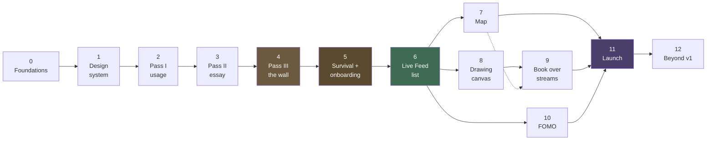

# Roadmap

> **The fourth planning document.**
> [`app_plan.md`](./app_plan.md) — *what* we're building · [`tech_stack.md`](./tech_stack.md) — *what with* · [`design_theme.md`](./design_theme.md) — *what it looks like* · **this file** — *in what order*
> **Last updated:** 2026-07-28

---

## How to use this

Twelve phases, ordered by dependency. **Do them in order.** Each one is small enough to finish, and each ends with something you can actually observe working — not "the code is written," but "install it and watch it happen."

Four rules that make this work:

1. **One phase at a time.** Don't start Phase 3 because Phase 2 got boring. The order exists because later phases genuinely need earlier ones.
2. **Finish the "Done when" test before moving on.** If you can't demonstrate it, the phase isn't done.
3. **Keep it installable.** From Phase 4 onward the app should always build and run. Never leave it broken overnight.
4. **Test on a real phone**, not just the emulator. Especially Phases 2, 4, and 5 — the emulator lies about background services.

Each phase follows the same six-part shape: **Goal · Why now · What you'll learn · Tasks · Done when · Reference.**

### The milestones that matter

| After | You have |
|-------|----------|
| **Phase 4** | The core loop works — Instagram gets blocked, an essay unlocks it |
| **Phase 5** | It survives a real phone (reboots, battery managers, first-run setup) |
| **Phase 6** | **A complete MVP** you could hand to someone |
| **Phase 11** | It's on the Play Store |

Everything between 6 and 11 makes the app *better*. Phase 6 makes it *exist*.

---

## The dependency graph

**Phases 7, 8, and 10 are independent of each other.** Once the MVP ships, do them in whatever order appeals — map, drawing, or digest first, your call.

---

# Phase 0 — Foundations & first run

### Goal
Android Studio installed, an empty app running on your actual phone, CI building on every push.

### Why now
Nothing else can start. This is also the phase where the tooling frustration lives — get it over with while there's nothing to break.

### What you'll learn
- What Android Studio, the SDK, and Gradle each do
- The anatomy of an Android project (`AndroidManifest.xml`, `build.gradle.kts`, `res/`, source tree)
- Enough Kotlin to be dangerous: `val`/`var`, functions, data classes, null safety (`?`, `?:`, `!!`)
- What a Composable function is and why the UI is written as functions instead of XML

> **Before you write app code, spend a few hours on Kotlin basics.** The official *Kotlin Koans* or Android's *Now in Android* codelab is enough. Fighting Kotlin syntax while also fighting a foreground service is two problems at once — separate them.

### Tasks

**Set up the machine**
- [ ] Install Android Studio (latest stable) — it bundles the JDK and SDK
- [ ] In SDK Manager, install the latest stable Android SDK platform + build tools
- [ ] Create an emulator (Pixel, recent API) for quick iteration
- [ ] On your phone: Settings → About → tap Build Number 7× → Developer Options → enable **USB debugging**
- [ ] Connect the phone, confirm it shows in Android Studio's device dropdown

**Create the project**
- [ ] New Project → **Empty Activity** (Compose) → package name (e.g. `com.yourname.pass`), language Kotlin, min SDK **26**
- [ ] Run it on the emulator, then on your phone. Confirm "Hello Android" appears on both
- [ ] Change the text, hit Run again — watch it update. This is your feedback loop

**Structure it**
- [ ] Convert build files to **Gradle Kotlin DSL** (`.gradle.kts`) if not already
- [ ] Create `gradle/libs.versions.toml` (the version catalog) and move dependencies into it
- [ ] Create the package structure from `tech_stack.md` §9: `core/`, `feature/`, `ui/`
- [ ] Add **Hilt** — annotate the Application class `@HiltAndroidApp`, MainActivity `@AndroidEntryPoint`
- [ ] Add **Navigation Compose** with two placeholder screens and a button between them
- [ ] Add **Room** with one throwaway entity; write and read a row to prove it works
- [ ] Add **DataStore**; save and read one boolean

**Version control & CI**
- [ ] `git init`, add a Kotlin/Android `.gitignore`, first commit
- [ ] Push to a private GitHub repo
- [ ] Add `.github/workflows/build.yml` — assemble debug + run unit tests on push
- [ ] Confirm the badge goes green

### Done when
You can push a commit, watch CI go green, and install the app on your phone where it shows two screens you can navigate between and a value that survives app restart.

### Reference
`tech_stack.md` §3.1 (core stack), §3.2 (libraries), §9 (repo layout), §10 (build & release)

---

# Phase 1 — The design system

### Goal
The bevel primitive and all ten standard components, built once, viewable in a gallery screen.

### Why now
`design_theme.md` §6 is explicit: *"This is the section to build first."* Every screen in the app is assembled from these ten forms. Build them now and every later phase is composition instead of invention. Skip this and you'll rewrite your buttons four times.

### What you'll learn
- Compose layout: `Box`, `Row`, `Column`, `Modifier` chains
- Custom drawing with `Modifier.drawBehind` and the `Canvas` composable
- Compose theming: `MaterialTheme`, `CompositionLocal`, custom colour/type schemes
- Bundling and using a custom font
- `@Preview` — Android Studio's live component preview, which makes this phase fast

### Tasks

**Foundations**
- [ ] Create `ui/theme/Color.kt` — all tokens from `design_theme.md` §4.1–4.3 as named constants
- [ ] Create `ui/theme/Type.kt` — the type scale from §5
- [ ] Source a pixel font (`Pixelify Sans` or `Silkscreen`, both OFL — **check and record the licence**), bundle the TTF in `res/font/`
- [ ] Add a sans face (Inter, or system Roboto) for body text
- [ ] Build `RetroTheme { }` wrapping the app, exposing colours + type via `CompositionLocal`

**The primitive**
- [ ] Build `Modifier.bevel(style: RAISED | PRESSED | SUNKEN)` implementing the exact recipe in §6.1
- [ ] Verify: 1px hard lines, zero corner radius, no shadow, no anti-aliasing
- [ ] `@Preview` all three states side by side

**The ten components** (`ui/components/`)
- [ ] 1. `RetroWindow` — raised frame, 4dp inset content, optional menu bar / status bar
- [ ] 2. `TitleBar` — 32dp, navy, pixel icon + bold white title + `_ □ ✕`; inactive variant
- [ ] 3. `RetroButton` — raised, **48dp minimum touch target** (pad the hit area, not the pixels), pressed state inverts bevel and shifts label 1px
- [ ] 4. `SunkenField` — white well, sunken bevel, 12dp padding, sans text
- [ ] 5. `MenuBar` — 28dp strip, pixel labels, mnemonic underlines, navy row highlight
- [ ] 6. `ContextMenu` — raised panel, 40dp rows, `▸` submarker, groove separators
- [ ] 7. `ListView` — raised column headers, white rows, navy selection bar
- [ ] 8. `StatusBar` — 24dp, sunken wells, pixel text, resize grip
- [ ] 9. `RetroDialog` — small window, cream or gray face, message + 1–2 buttons
- [ ] 10. `PixelIcon` — 32×32 base, integer scaling only, **`FilterQuality.None`**

**Supporting**
- [ ] `RetroScrollbar` — chunky, visible, with arrow buttons (§6.3 — do not hide it)
- [ ] `SegmentedProgress`, `RetroCheckbox`, `RetroRadio`, `GrooveSeparator`
- [ ] `Taskbar` — start-style button + sunken clock well
- [ ] `Wallpaper` — pixel sky/hills, day and night variants, hard bands not gradients

**Prove it**
- [ ] Build a dev-only **Component Gallery** screen showing every component in every state
- [ ] Run the accessibility floor check (§9): all targets ≥48dp, no pixel type below 16sp, disabled state changes the *bevel* not just the colour
- [ ] Toggle day/night — confirm only the wallpaper changes, chrome stays gray

### Done when
The gallery screen shows all ten components rendering correctly at both day and night, every tap target measures ≥48dp, and nothing is blurry when you zoom in on a pixel icon.

### Reference
`design_theme.md` §4 (colour), §5 (type), §6 (the ten forms), §7 (motion), §9 (accessibility floor), §12 (assets & legal)

---

# Phase 2 — Pass I: watching app usage

### Goal
The app knows which app is in the foreground and counts down a daily budget that survives restarts.

### Why now
This is the foundation of Feature 1 and the hardest native work in the project. Everything else about the Pass sits on top of it.

### What you'll learn
- Android permissions: normal, runtime, and **special access** (the Settings hand-off kind)
- `UsageStatsManager` and the `queryEvents()` API
- Foreground services and why Android needs a persistent notification
- Coroutines and `Flow` for a repeating background tick
- Room entities, DAOs, and reactive queries

> **The permission here is not a normal dialog.** `PACKAGE_USAGE_STATS` sends the user to a Settings screen and hopes they come back. You detect whether it was granted with `AppOpsManager`, not with the usual permission API. This surprises everyone the first time.

### Tasks

**Permission**
- [ ] Add `PACKAGE_USAGE_STATS` to the manifest
- [ ] Build a checker using `AppOpsManager.unsafeCheckOpNoThrow(OPSTR_GET_USAGE_STATS, ...)`
- [ ] Build a request screen that explains what it reads (**app names and durations, nothing inside the apps**) and launches `Settings.ACTION_USAGE_ACCESS_SETTINGS`
- [ ] Detect on return whether it was actually granted — don't assume

**Detection**
- [ ] Wrap `UsageStatsManager.queryEvents()` in a repository that returns the current foreground package
- [ ] Watch for `ACTIVITY_RESUMED` / `ACTIVITY_PAUSED` events
- [ ] Implement **adaptive polling** (`app_plan.md` §2.7): 5–10s when budget is plentiful, 2s when under 5 minutes, **1s when the wall is armed**, fully paused when the screen is off or no watched app is foreground
- [ ] **Measure the real latency on a physical device** — some OEM builds add their own reporting lag on top of your poll rate

**The service**
- [ ] Create a foreground service that runs the polling loop
- [ ] Add `FOREGROUND_SERVICE` + `FOREGROUND_SERVICE_SPECIAL_USE` and declare the type in the manifest
- [ ] Build a minimal, low-priority persistent notification
- [ ] Request `POST_NOTIFICATIONS` at runtime (Android 13+)
- [ ] Start the service after permissions are granted; stop cleanly on demand

**State & storage**
- [ ] Room entities: `UsageDay`, `PassLedger` (schema in `tech_stack.md` §7)
- [ ] DataStore settings: daily budget, watched app list, reset hour (default **4am**, not midnight)
- [ ] Decrement the budget only while a watched app is genuinely foreground; pause instantly on screen-off
- [ ] Implement the daily reset at the chosen hour
- [ ] **One shared budget** across all watched apps by default — app-hopping must not multiply the allowance

**A temporary screen**
- [ ] Build a debug screen showing: current foreground package, minutes used today, minutes remaining, service running state
- [ ] Use it to watch the numbers move in real time

### Done when
Open Instagram with the debug screen visible on a second device (or check it afterward) — the counter ticks down only while Instagram is actually open, pauses when you lock the screen, and shows the correct total after you force-quit and reopen your app.

### Reference
`app_plan.md` §2.6 (edge cases), §2.7 (technical notes, adaptive polling table) · `tech_stack.md` §7 (data model), §8 (permissions)

---

# Phase 3 — Pass II: the essay

### Goal
When the budget is spent, writing an essay on a random word issues a new pass.

### Why now
Phase 2 knows *when* the pass expires. This phase is *how you get another one* — the actual product idea.

### What you'll learn
- Compose text input and state hoisting
- Intercepting and restricting text input (harder than it sounds)
- Room relations across two entities
- Writing a Compose screen from the components you built in Phase 1

### Tasks

**The challenge**
- [ ] Build a word list — ~2,000 concrete nouns and abstract concepts, bundled as an asset (works offline)
- [ ] Random word selection, avoiding recent repeats
- [ ] Essay screen using `RetroWindow` + `MenuBar` + `SunkenField` + `StatusBar`, styled as Notepad (`design_theme.md` §10)
- [ ] Word counter in the status bar: `words: 84 / 150`
- [ ] Prompt copy in the human voice: *"Write 150 words. Anything you like. Nobody reads this but you."*
- [ ] **No timer.** Deliberate — a countdown encourages garbage typing

**Anti-cheat** (`app_plan.md` §2.5)
- [ ] Disable paste — strip it from the text selection toolbar
- [ ] **Bulk-insert detection** — reject any single change adding more than ~15 characters
- [ ] Disable keyboard suggestions and autocomplete via `InputType` flags
- [ ] Typing-cadence check — flag statistically impossible uniform intervals (scripts), not fast humans
- [ ] Unique-word ratio floor of 40%
- [ ] Add the dictation opt-out from §2.5 — a user who relies on dictation gets a longer word requirement instead of a lockout
- [ ] Failure messages must be **flat and non-accusatory**: *"That looked like pasted text, so it wasn't counted. Keep going."* Never "NICE TRY"

**Issuing the pass**
- [ ] Validation: word count, unique-word ratio, typed-not-inserted, sentence-like structure
- [ ] On success, write the `Essay` row and a linked `PassLedger` row, add minutes to the budget
- [ ] Pass state machine: `NoPass → Active → Expiring → Expired → Challenge → Active` (`app_plan.md` §2.3)
- [ ] Essay history screen — a `ListView`, read-only, no scores or grades
- [ ] **No quality grading.** Length and typed-ness only (`app_plan.md` §6.6, risk 4)

### Done when
With zero minutes remaining, you can open the app, get a random word, discover that paste genuinely doesn't work, hand-type 150 words, submit, and watch the budget jump to 15 minutes. Force-quit and reopen — the pass is still there.

### Reference
`app_plan.md` §2.4 (mechanics table), §2.5 (anti-cheat and its limits) · `design_theme.md` §8 (the essay editor is a chrome-free exception), §11 (voice)

---

# Phase 4 — Pass III: the wall ⭐

### Goal
Instagram opens with the budget spent → an overlay appears over it within about a second → the essay renews access.

### Why now
This connects Phases 2 and 3 into the actual product. **After this phase the core idea works end to end.**

### What you'll learn
- `SYSTEM_ALERT_WINDOW` and drawing over other apps
- `WindowManager` and `TYPE_APPLICATION_OVERLAY`
- Why background apps can't just launch an Activity on modern Android

> **The critical constraint:** since Android 10, apps cannot start an Activity from the background. `startActivity()` from your service will fail *silently* — no crash, no log, nothing happens. You must draw a `TYPE_APPLICATION_OVERLAY` window instead. This is the single most common way this feature is built wrong.

### Tasks

**Permission**
- [ ] Add `SYSTEM_ALERT_WINDOW` to the manifest
- [ ] Check with `Settings.canDrawOverlays()`
- [ ] Request screen explaining why, launching `Settings.ACTION_MANAGE_OVERLAY_PERMISSION`

**The overlay**
- [ ] Add a `TYPE_APPLICATION_OVERLAY` view via `WindowManager` from the service
- [ ] Render it as a `RetroDialog` — cream balloon, centred, two buttons (`design_theme.md` §10)
- [ ] Wire it to fire the instant the budget hits zero while a watched app is foreground
- [ ] Two actions: **Write an essay** (opens the app) and **Not worth it** (dismisses, offers the Live Feed)
- [ ] Handle correct dismissal and window cleanup — leaked overlay windows are a real bug class

**The loop**
- [ ] From the overlay → essay screen → on success, dismiss the overlay and return to Instagram
- [ ] Track where the user came from: overlay entry returns to Instagram, deliberate entry banks the pass and stays in the app
- [ ] Gentle 2-minutes-remaining heads-up (a toast or soft banner, not the full wall)

**Both entry points** (`app_plan.md` §2.2)
- [ ] Reactive path: over-use → overlay
- [ ] Deliberate path: open the app → see remaining time → bank a pass proactively
- [ ] Confirm both feel like the same system

### Done when
Set your budget to 1 minute. Open Instagram. Scroll for a minute. **The wall appears over Instagram within about a second.** Tap through, write the essay, and land back in Instagram with fresh time. That's the product.

### Reference
`app_plan.md` §2.2 (entry points + flowchart), §2.7 (overlay technical notes) · `design_theme.md` §10 (the overlay is a modal dialog box)

---

# Phase 5 — Survival & onboarding ⭐

### Goal
The app survives reboots, OEM battery managers, and a first-time user who has never seen it before.

### Why now
Phase 4 works on your desk. This phase makes it work on a stranger's Xiaomi. **This is the top risk in the whole project** (`app_plan.md` §2.7) — a silently-killed service means the app appears broken with no error.

### What you'll learn
- `BOOT_COMPLETED` broadcast receivers
- WorkManager for periodic background checks
- Battery optimisation exemptions and why OEMs ignore them anyway

### Tasks

**Survival**
- [ ] `BOOT_COMPLETED` receiver that restarts the service; add `RECEIVE_BOOT_COMPLETED`
- [ ] Persist and correctly restore the remaining budget across reboot — **no free reset**
- [ ] WorkManager periodic watchdog that re-arms the service if it finds it dead
- [ ] Request battery-optimisation exemption
- [ ] **Per-OEM instructions screen** — Xiaomi, Oppo, Vivo, Samsung each bury the setting somewhere different (`dontkillmyapp.com` documents them all)
- [ ] **Self-diagnosis**: detect gaps in monitoring and say so on next open — *"Looks like your phone stopped this app in the background. Here's how to fix it."* Silent failure is what generates one-star reviews

**Edge cases** (`app_plan.md` §2.6)
- [ ] Force-stop recovery
- [ ] Midnight/4am rollover correctness
- [ ] Screen-off pause verification
- [ ] **Panic unlock** — 3 per month, instant, no essay, no questions asked, shown in settings without judgement
- [ ] Budget changes: lowering applies immediately, raising waits until next reset
- [ ] Optional notification grace period (60s to read a DM)

**Onboarding** — the Setup Wizard (`design_theme.md` §10)
- [ ] Wizard-framed screens with `< Back` / `Next >` bottom-right, **one decision per pane**
- [ ] Pane 1: the idea, in plain language
- [ ] Pane 2: pick watched apps (list of installed apps)
- [ ] Pane 3: set daily budget
- [ ] Panes 4–6: **one permission per screen**, each with a one-line reason and a picture of the exact toggle to flip
- [ ] Detect on return whether each was actually granted
- [ ] Privacy screen: *"your essays never leave this phone"* — state it plainly (`app_plan.md` §6.3)

**Settings**
- [ ] Watched apps · budget & essay length · reset hour · panic unlocks remaining · **permission health check** · privacy

### Done when
Factory-fresh install on a physical Xiaomi or Oppo: complete onboarding, reboot the phone, wait an hour without opening the app — and the budget still tracks correctly. If the OS killed the service, the app *tells you* on next open instead of failing silently.

### Reference
`app_plan.md` §2.6 (edge cases table), §2.7 (OEM warning box), §6.2 (permissions ledger), §6.4 (nav map) · `design_theme.md` §10

---

# Phase 6 — Live Feed I: streams ⭐ MVP

### Goal
A list of live streams that play full screen with Clear Mode. **This completes the MVP.**

### Why now
The wall needs a door next to it. `app_plan.md` is explicit that a wall with no alternative is a wall people uninstall. List-only first — the map is Phase 7 and isn't needed to prove the idea.

### What you'll learn
- Media3 / ExoPlayer and HLS streaming
- WebView-based embedding (the YouTube player)
- Immersive full-screen mode
- Fetching and caching remote JSON

### Tasks

**The registry**
- [ ] Hand-curate **~15 excellent streams** for launch — quality over quantity
- [ ] Write `backend/streams.json` using the schema in `app_plan.md` §3.6
- [ ] Favour **direct-HLS webcams** where possible — simpler and fully under our control
- [ ] Publish to CDN at `/v1/streams.json`; bundle a fallback copy in the APK
- [ ] Write the daily health-check script (HLS manifest ping; YouTube via `videos.list` → `liveBroadcastContent == "live"`)
- [ ] Add it to the GitHub Actions cron

**Playback**
- [ ] Media3 + `media3-exoplayer-hls` for direct webcam streams
- [ ] `android-youtube-player` (official IFrame) for YouTube sources — **never rip the HLS URL**, it's a ToS violation and permanently fragile
- [ ] Quality selector, auto by default, mobile-data warning, data-saver cap

**The UI**
- [ ] Stream list using `ListView`, grouped by category
- [ ] Preview card: name, place, local time, live thumbnail
- [ ] Full-screen player
- [ ] **Clear Mode** — all chrome gone, immersive mode, tap-to-reveal for 3s, slow fade not a snap
- [ ] `FLAG_KEEP_SCREEN_ON` while active; optional auto-dim after 10 min; optional sleep timer
- [ ] Ambient audio toggle
- [ ] Favourites
- [ ] **Live Feed does not cost a pass** — this is the free alternative, not another ration

### Done when
Open the app with no time left, tap "Not worth it" on the wall, land on the stream list, pick a river, and sit with it full screen in Clear Mode with zero UI on screen. The whole product thesis is now demonstrable to another person.

### Reference
`app_plan.md` §3 (all), especially §3.4 (Clear Mode), §3.5 (free, not rationed), §3.6 (registry) · `tech_stack.md` §5.2 · `design_theme.md` §8 (streams are a chrome-free exception)

---

# Phase 7 — Live Feed II: the map

### Goal
Browse streams by tapping pins on a calm, dark world map.

### Why now
The signature interaction, but not required for the MVP to be useful. Ship the list first, add the map once the core loop is proven.

### What you'll learn
- Integrating a native map SDK into Compose (`AndroidView` interop)
- Map styling and tile sources
- Coordinate/marker handling

### Tasks
- [ ] Add MapLibre GL Native; wrap `MapView` in `AndroidView`
- [ ] Point it at **OpenFreeMap** tiles (free, unlimited, no API key)
- [ ] Write a custom map style — **calm and dark**, not a navigation app
- [ ] Render pins from the registry, coloured by category
- [ ] Category filter: rivers · coasts · mountains · cities · wildlife · space
- [ ] Mood filter: calm · alive · dark & quiet
- [ ] "Surprise me" random pin
- [ ] Tap pin → preview card → full screen
- [ ] Frame the map inside a `RetroWindow` (`design_theme.md` §10)
- [ ] **Expand the registry to ~50 streams**
- [ ] Verify offline behaviour — bundled registry, cached tiles, graceful failure

### Done when
Pan to Norway, tap a harbour pin, read its local time on the card, and open it full screen. The map looks calm and dark, and it costs nothing to run.

### Reference
`app_plan.md` §3.3 (flowchart), §3.6 (registry) · `tech_stack.md` §5.2 (maps)

---

# Phase 8 — Drawing Book I: the canvas

### Goal
A multi-page sketchbook you can draw in, with vector strokes and unlimited undo.

### Why now
Independent of the map — do this or Phase 7 first, your preference. Needs the design system (Phase 1) and nothing else.

### What you'll learn
- Compose `Canvas` and `Path` drawing
- Touch handling: `pointerInput`, drag gestures, pressure, stylus detection
- Rendering performance and offscreen layer caching
- Serializing complex objects into Room

> **Store strokes as vectors, never bitmaps.** A stroke is a list of points plus a tool descriptor. This makes undo a list-pop, keeps pages at a few KB instead of a few MB, and lets pages re-render crisply at any zoom. Getting this wrong is expensive to reverse later.

### Tasks

**Data model**
- [ ] Room entities `Book`, `Page`, `Stroke` (schema in `tech_stack.md` §7)
- [ ] Serialize stroke points as JSON via a `TypeConverter`

**Drawing**
- [ ] Capture touch points with `pointerInput` + drag gestures
- [ ] Smooth raw points (Catmull-Rom or quadratic Bézier) — unsmoothed touch input looks visibly jagged
- [ ] Render strokes as `Path` on a Compose `Canvas`
- [ ] **Performance**: cache completed strokes into an offscreen bitmap layer, live-render only the stroke under the finger, composite the two
- [ ] Pressure via `MotionEvent.getPressure()`; stylus detection via `getToolType()`
- [ ] Palm rejection when a stylus is active

**Tools** (kept deliberately small)
- [ ] Pencil · pen · marker · eraser (offer both stroke-aware and pixel-wise)
- [ ] ~16 curated colours + full picker — the default palette should look good even on a random pick
- [ ] Size slider
- [ ] Unlimited undo/redo, persisted per page
- [ ] Two-finger pan/zoom; one finger always draws

**The book**
- [ ] Page grid with thumbnails, styled as MS Paint (`design_theme.md` §10)
- [ ] Create, reorder, delete pages
- [ ] Tool palette **beside** the canvas, never on it
- [ ] Canvas is a plain white or cream sunken well — no pixel grid, no texture (`design_theme.md` §8)
- [ ] Export PNG + transparent PNG via the Android share sheet

**Explicitly not in v1:** layers, shapes, text, fill/bucket, selection.

### Done when
Draw a few hundred strokes without lag, undo back to blank, redo forward, close the app, reopen — the page is exactly as you left it. Export a PNG and open it in your gallery.

### Reference
`app_plan.md` §4.3 (data model), §4.4 (tools), §4.6 (technical notes) · `design_theme.md` §8 (canvas is chrome-free)

---

# Phase 9 — Drawing Book II: over streams

### Goal
Pull the drawing book up over a live stream, swipe it down to look at the view, draw the place while sitting with it.

### Why now
Needs both the canvas (Phase 8) and the player (Phase 6). This is the interaction that makes the app specific rather than generic.

### What you'll learn
- Bottom-sheet gesture handling in Compose
- Coordinating two features' lifecycles (player + canvas)

### Tasks
- [ ] `Open drawing book` in the in-stream menu
- [ ] **Opaque** sheet slides up over the stream — not translucent (`app_plan.md` §4.5)
- [ ] Swipe down / tap handle → sheet drops, live view revealed
- [ ] Swipe up → back to the same page, exactly where you left off
- [ ] **Half-open rest position** — view on top, paper below. Probably how most people will actually use it
- [ ] **Freeze frame** — pause the stream so a moving subject holds still. Works at any sheet position
- [ ] Keep the stream *playing* behind the sheet (drop quality to save bandwidth, don't pause)
- [ ] Tag saved pages with `source_stream` + timestamp
- [ ] Location chip on the page: `Reine, Norway · 3:14am local`
- [ ] Confirm it works on **every** stream — no per-stream capability flags

### Done when
Watching a harbour, pull up the book, rest it half-open, draw what you see while it's live, freeze the frame to catch a boat, save — and the page shows in your book with the place and local time on it.

### Reference
`app_plan.md` §4.5 (specifics + why a sheet not a translucent layer), §3.7 (playback while the sheet is up)

---

# Phase 10 — FOMO

### Goal
A finite daily bulletin of what's trending, so quitting the feed doesn't feel like falling behind.

### Why now
Independent of Phases 7–9. It's the only feature needing real backend work, so it's a natural standalone chunk.

### What you'll learn
- Python API clients and scheduled jobs
- GitHub Actions cron workflows
- Text clustering without machine learning

> **The design risk, restated:** this feature is structurally a feed, and built carelessly it becomes the thing the app exists to replace. The constraints below aren't stylistic — they're what keep it a bulletin.

### Tasks

**Backend** (`backend/`)
- [ ] One module per source: Google Trends RSS · Reddit (OAuth2) · YouTube Data · Wikipedia Pageviews · Hacker News · GDELT
- [ ] Isolate failures — one dead source must not kill the digest
- [ ] Set a descriptive `User-Agent` (Reddit blocks requests without one)
- [ ] Clustering: normalise titles → token overlap + fuzzy match (`rapidfuzz`, ~0.7) → rank by cross-source presence → top 18
- [ ] Extractive summary: first sentence of the top article — **no API needed**
- [ ] Write `digest.json`; publish to CDN at `/v1/digest.json`
- [ ] GitHub Actions cron, once daily; API keys as repository secrets

**Client**
- [ ] Fetch on open if the cached digest is stale; cache in Room
- [ ] Render as a `ListView` — a file listing (`design_theme.md` §10)
- [ ] Card: topic · 2-sentence neutral summary · source names · read-more link
- [ ] **No images by default** — image on tap only
- [ ] **No engagement metrics.** No like counts, no view counts, no "1.2M people are talking about this" — those numbers *are* the FOMO
- [ ] **No pull-to-refresh.** It's a slot-machine lever
- [ ] Hard bottom: `0 items — you're caught up.` in the status bar
- [ ] Read state remembered; same-day return shows "caught up"

**Optional quality pass** (skip for v1)
- [ ] Swap extractive summaries for LLM-generated ones behind a `summarize()` interface
- [ ] Free tier: Gemini Flash primary, Groq fallback, extractive floor
- [ ] **Never send user data** — public headlines only (`tech_stack.md` §6)

### Done when
Open FOMO, read about 18 items, hit the bottom, see "you're caught up", close it — and reopening the same day still says you're caught up. It should feel like finishing a newspaper.

### Reference
`app_plan.md` §5 (all), especially §5.2 (the design tension) · `tech_stack.md` §5.1 (sources), §6 (summarization) · `design_theme.md` §10 (the FOMO empty state)

---

# Phase 11 — Launch ⭐

### Goal
On the Play Store.

### Tasks

**Quality**
- [ ] Full accessibility audit against `design_theme.md` §9 — targets, type sizes, contrast, content descriptions, system font scale, reduce-motion
- [ ] Test on physical Xiaomi/Oppo/Samsung — the OEM battery path especially
- [ ] Test the full first-run flow on a factory-fresh install
- [ ] Verify offline behaviour on every screen
- [ ] Confirm **no user data leaves the device** — check with a network inspector, don't assume

**Store**
- [ ] Google Play developer account (**$25, one-time** — the only cost in the project)
- [ ] Play App Signing; upload key in GitHub secrets
- [ ] Store listing: title, description, screenshots, feature graphic
- [ ] Privacy policy — short, honest, matching `app_plan.md` §6.3
- [ ] Data safety form — declare accurately (usage access is read locally, nothing transmitted)
- [ ] Confirm no trademark surface area: no Windows flag, no `start` wordmark styled as Microsoft's, no "Windows" in any user-facing string (`design_theme.md` §12)
- [ ] Confirm all pixel art is original and font licences are recorded

**Release**
- [ ] Internal testing → fix
- [ ] Closed testing with real users → fix
- [ ] Open testing → fix
- [ ] Production

### Done when
Someone who has never met you installs it from the Play Store and successfully writes their first essay.

### Reference
`tech_stack.md` §10 (build & release), §12 (cost) · `design_theme.md` §9, §12

---

# Phase 12 — Beyond v1

Not scheduled. Revisit after the app has real users.

| Candidate | Notes |
|---|---|
| **iOS** | Requires the FamilyControls / Screen Time entitlement — a special request to Apple, not guaranteed. Only Feature 1 is constrained; Features 2–4 port cleanly, and the backend is untouched (`tech_stack.md` §11) |
| **Stream auto-discovery** | YouTube Data API search + auto geo-tagging, replacing pure hand-curation |
| **Translucent tracing** | The original overlay idea, legal on non-YouTube webcam sources only. Add only if the sheet turns out to be missed (`app_plan.md` §4.5) |
| **Widgets** | Home-screen time-remaining widget |
| **Stylus polish** | Tilt, richer pressure curves, per-tool dynamics |
| **Hard mode** | Opt-in device-admin uninstall protection for users who ask (`app_plan.md` §6.6, risk 3) |

---

## Cross-cutting — true in every phase

- [ ] **Accessibility floor** — ≥48dp targets, ≥16sp pixel type, disabled state changes the bevel not just the colour
- [ ] **No user data leaves the device** — essays, drawings, usage stats stay local, always
- [ ] **No API keys in the app** — every key lives in GitHub Actions secrets
- [ ] **No infinite scroll anywhere** — every surface has a bottom
- [ ] **Never scold the user** — machine voice for facts, human voice for choices, guilt in neither
- [ ] **Test on a physical device** — the emulator lies about background services and OEM behaviour
- [ ] **Keep it installable** — from Phase 4 onward, `main` always builds and runs

---

## Risk checkpoints

The live risks from `app_plan.md` §6.6, mapped to where you must confront them:

| Risk | Phase | What to do about it |
|---|---|---|
| **OEM battery killers** — the top risk | **5** | Per-OEM guidance, WorkManager watchdog, self-diagnosis on next open. Test on real Xiaomi/Oppo hardware |
| **Default budget is a guess** | **6** | 30 min is unvalidated. Once the MVP exists, dogfood it for a fortnight and adjust |
| **Stream rot** | **6** | Health-check job from day one, not as an afterthought — streams die weekly |
| **FOMO becoming a feed** | **10** | The constraints in that phase are the mitigation. Watch usage time; if it creeps up, cut the feature |
| **Uninstall bypass** | — | Accepted, not fixed. Optional hard mode in Phase 12 |
| **Monetisation** | — | Not urgent — running cost is $0/month, so the app never *needs* revenue |

---

## Deliberately not in v1

Written down so scope creep has an answer:

Layers, shapes, text, or fill in the drawing tools · essay quality grading · social features or sharing to a timeline · user accounts or cloud sync · streaks, scores, or productivity metrics · ads (ever) · translucent stream tracing · stream auto-discovery · iOS.

---

## Appendix — phases at a glance

| # | Phase | Key deliverable | Milestone |
|---|-------|-----------------|-----------|
| 0 | Foundations | Empty app runs, CI green | |
| 1 | Design system | 10 components in a gallery | |
| 2 | Pass I — usage | Budget ticks down and persists | |
| 3 | Pass II — essay | Essay issues a pass | |
| 4 | Pass III — the wall | Overlay blocks Instagram | ⭐ Core loop |
| 5 | Survival + onboarding | Works on a stranger's phone | ⭐ Real-world ready |
| 6 | Live Feed — list | Streams + Clear Mode | ⭐ **MVP** |
| 7 | Map | Pins on a calm world map | |
| 8 | Drawing canvas | Sketchbook with vector strokes | |
| 9 | Book over streams | Draw the place you're watching | |
| 10 | FOMO | Daily finite bulletin | |
| 11 | Launch | Live on Play | ⭐ **Public** |
| 12 | Beyond v1 | iOS, auto-discovery, tracing | Horizon |
