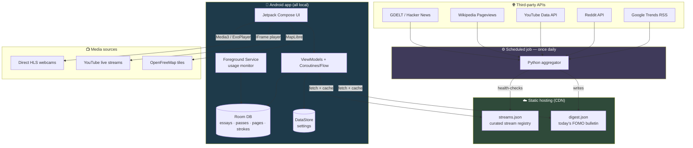
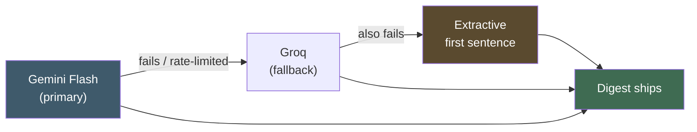
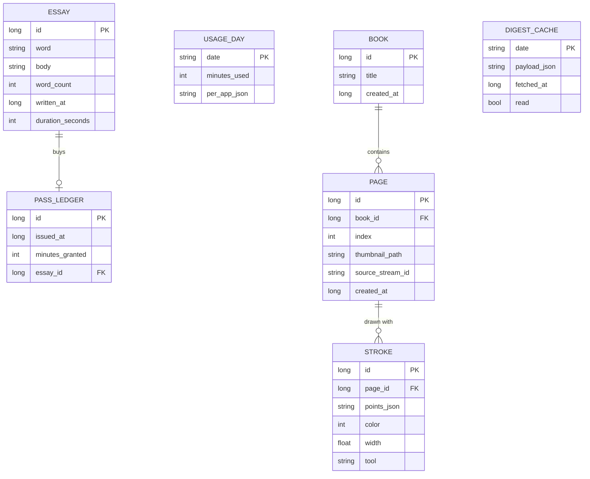

# Tech Stack

> [`app_plan.md`](./app_plan.md) — *what* we're building · **this file** — *what with* · [`design_theme.md`](./design_theme.md) — *what it looks like* · [`roadmap_plan.md`](./roadmap_plan.md) — *in what order*
> **Platform:** Android first (iOS deferred to v2)
> **Last updated:** 2026-07-28

---

## 1. Principles

Four rules that drive every choice below.

| # | Principle | Consequence |
|---|-----------|-------------|
| 1 | **Local-first.** The user's data stays on the phone. | No user accounts, no sync, no server-side database. Essays and drawings never leave the device. |
| 2 | **No API keys in the app.** | Every third-party API is called from a scheduled backend job, never from the client. The client only downloads static JSON. |
| 3 | **Native where it counts.** | Three of four features are deep OS integrations. Kotlin + Compose, not a cross-platform framework. |
| 4 | **Free to build and free to run.** | Every service in the stack is a free tier or costs nothing at all. Running cost is **$0/month** (§12). Nothing here has a paid dependency. |

---

## 2. The whole system



**The whole backend is the middle-left box.** One Python script, one cron trigger, two output files. No server process, no database, no user records.

---

## 3. Android app

### 3.1 Core

| Layer | Choice | Why this one |
|-------|--------|--------------|
| **Language** | Kotlin | Only real option for modern Android. Coroutines make the async work (polling, video, canvas) clean. |
| **UI toolkit** | Jetpack Compose + Material 3 | Declarative, and its `Canvas` API is genuinely good for the drawing book — imperative `View` code would be far more work. |
| **Min SDK** | 26 (Android 8.0) | `UsageStatsManager` is reliable from here. Covers ~95% of active devices. |
| **Target SDK** | Latest stable | Required by Play Store policy; also where the foreground-service and overlay rules are defined. |
| **Architecture** | MVVM, single Activity | Compose Navigation for the screen graph. One Activity keeps the overlay/service interaction simpler. |
| **Async** | Coroutines + Flow | `Flow` for the usage-monitor tick and the pass-state stream; `StateFlow` into Compose. |
| **DI** | Hilt | Standard, and the service/ViewModel injection is the case it's built for. |
| **Build** | Gradle Kotlin DSL + version catalog (`libs.versions.toml`) | Single source of truth for dependency versions. |

**Why not React Native or Flutter.** Three of the four features are native OS work: an always-on foreground service polling `UsageStatsManager`, a `SYSTEM_ALERT_WINDOW` overlay drawn over another app, and a high-frequency touch-capture canvas. Under a cross-platform framework each of those becomes a hand-written native module *plus* a bridge — more code, worse canvas latency, an extra debugging layer. The thing you'd buy with that cost is iOS portability, and on iOS the flagship feature can't be built the same way regardless (see §11). Cross-platform buys us nothing here.

### 3.2 Libraries

| Concern | Library | Artifact |
|---------|---------|----------|
| Local database | Room | `androidx.room:room-runtime`, `room-ktx`, `room-compiler` (KSP) |
| Key–value settings | DataStore (Preferences) | `androidx.datastore:datastore-preferences` |
| Background work | WorkManager | `androidx.work:work-runtime-ktx` |
| Video playback | Media3 / ExoPlayer | `androidx.media3:media3-exoplayer`, `media3-ui`, `media3-exoplayer-hls` |
| YouTube playback | android-youtube-player | `com.pierfrancescosoffritti.androidyoutubeplayer:core` |
| Maps | MapLibre GL Native | `org.maplibre.gl:android-sdk` |
| Networking | OkHttp | `com.squareup.okhttp3:okhttp` |
| JSON | kotlinx.serialization | `org.jetbrains.kotlinx:kotlinx-serialization-json` |
| Image loading | Coil | `io.coil-kt:coil-compose` |
| Navigation | Navigation Compose | `androidx.navigation:navigation-compose` |
| Testing | JUnit5 · MockK · Turbine · Robolectric · Compose UI Test | — |

> **Pin versions at project init**, not from this document — resolve the latest stable release of each when the version catalog is first written, and let Dependabot/Renovate keep it current. Version numbers written into a planning doc go stale within weeks.

**On networking:** we only ever fetch two static JSON files. Retrofit is the reflexive choice but is overkill for two GETs — **OkHttp + kotlinx.serialization directly** is leaner and one dependency lighter. Retrofit is a fine substitute if the team already knows it; nothing else in the stack depends on the decision.

### 3.3 Which feature uses what

| | The Pass | Live Feed | Drawing Book | FOMO |
|---|---|---|---|---|
| **Compose UI** | ✅ | ✅ | ✅ (Canvas) | ✅ |
| **Room** | essays, passes, usage | favourites | books, pages, strokes | digest cache |
| **DataStore** | budget, watched apps, reset hour | quality, audio prefs | tool defaults | read state |
| **Foreground Service** | ✅ core | — | — | — |
| **WorkManager** | service watchdog | — | — | daily digest fetch |
| **Media3** | — | ✅ HLS webcams | — | — |
| **YouTube IFrame** | — | ✅ YouTube streams | — | — |
| **MapLibre** | — | ✅ | — | — |
| **OkHttp** | — | ✅ registry fetch | — | ✅ digest fetch |
| **Coil** | — | thumbnails | page grid | card images (on tap) |

---

## 4. Backend

### 4.1 What it actually is

Not a server. **One Python script on a daily cron trigger that writes two JSON files to static hosting.**

```
Daily at 05:00 UTC
   │
   ├─▶ fetch_trends()    → cluster → rank  ──▶  digest.json
   └─▶ health_check()    → ping every stream ──▶  streams.json (+ alert on dead ones)
```

| | Choice | Why |
|---|--------|-----|
| **Language** | Python 3.12 | Best ecosystem for the fetch/parse/cluster work (`httpx`, `feedparser`, `rapidfuzz`). |
| **Scheduler** | GitHub Actions cron | Free for public repos, generous for private. No infrastructure to run. |
| **Hosting** | Cloudflare Pages or R2 | Free tier, global CDN, HTTPS. GitHub Pages also works — commit the JSON and serve it. |
| **Secrets** | GitHub Actions repository secrets | API keys live here and nowhere else. |
| **Monitoring** | Job failure → GitHub notification; dead streams → same | Enough for one daily job. |

**Alternative if you'd rather not use GitHub Actions:** Cloudflare Workers with a Cron Trigger, writing to KV or R2. Also free at this volume. Pick either; nothing downstream depends on the choice.

### 4.2 Output contract

```
https://cdn.<yourdomain>/v1/streams.json     # curated stream registry (§3.6 of app_plan)
https://cdn.<yourdomain>/v1/digest.json      # today's FOMO bulletin
```

Both are **versioned by path** (`/v1/`) so a breaking schema change can ship without bricking older app installs. The client caches both in Room and ships a fallback copy of `streams.json` inside the APK so the map works offline and on first launch.

---

## 5. APIs — the detailed part

### 5.1 FOMO sources

Everything here is fetched **server-side, once per day**. None of these keys ever ship in the app.

| Source | What it gives us | Endpoint | Auth | Limits | Notes |
|--------|------------------|----------|------|--------|-------|
| **Google Trends** | Daily trending searches — the closest thing to "what's blowing up" | `trends.google.com/trending/rss?geo=IN` | None | Undocumented, be polite | RSS. **Unofficial** — no SLA, parse defensively and treat failure as non-fatal. |
| **Reddit** | Internet-culture moments, memes, discourse | `oauth.reddit.com/r/popular/hot` | OAuth2 client credentials (register a "script" app) | 100 req/min per client | **Must** send a descriptive `User-Agent` or you get blocked. Token expires — refresh it. |
| **YouTube Data API v3** | Trending video/creator moments | `videos.list?chart=mostPopular&regionCode=IN` | API key | 10,000 units/day; `videos.list` costs 1 | Trivially within quota at once daily. Same key reused for stream health checks (§5.2). |
| **Wikipedia Pageviews** | Who/what people suddenly care about — excellent, underused signal | `wikimedia.org/api/rest_v1/metrics/pageviews/top/en.wikipedia/all-access/{Y}/{M}/{D}` | None | Be polite, set `User-Agent` | Free, official, stable. Best signal-to-effort ratio of the set. |
| **Hacker News** | Tech | `hacker-news.firebaseio.com/v0/topstories.json` | None | None | Free, official, no key. |
| **GDELT** | Actual news events, global | `api.gdeltproject.org/api/v2/doc/doc?query=...&mode=artlist&format=json` | None | Be polite | Free, enormous, production-safe. |

> ### ⚠️ Do not use NewsAPI's free tier
> Its free plan is **explicitly development-only** and prohibits production use. Using it in a shipped app violates their terms. **GDELT covers the same ground for free with no such restriction** — that's why it's the recommendation above. If a paid news API is wanted later, evaluate NewsData.io or Mediastack, but GDELT should be enough.

> ### ⚠️ And do not scrape Instagram
> No public trends API exists. Scraping violates their ToS, breaks constantly, and puts the whole app at risk. The sources above surface the same cultural moments anyway — virality crosses platforms within hours. This is settled, not open (see `app_plan.md` §5.3).

**Clustering.** The same story shows up in five sources with five headlines. Pipeline:

```
fetch all sources (parallel, each failure isolated)
   → normalise titles (lowercase, strip punctuation/stopwords)
   → cluster by token overlap + fuzzy match (rapidfuzz, threshold ~0.7)
   → rank by cross-source presence (a story in 4 sources beats one in 1)
   → take top 18
   → write digest.json
```

Start with **keyword/fuzzy clustering, not embeddings.** It's a few dozen lines, has no model dependency, and is good enough at this scale (a few hundred items/day). Revisit only if quality is visibly poor.

### 5.2 Live Feed

| Concern | Choice | Details |
|---------|--------|---------|
| **Stream discovery** | Manual curation | ~50 hand-picked streams at launch. No API. Schema in `app_plan.md` §3.6. |
| **Health checking** | Daily, in the same cron job | Direct HLS: `GET` the `.m3u8` manifest, expect 200 + valid playlist. YouTube: `videos.list?part=snippet,liveStreamingDetails&id=X` → check `liveBroadcastContent == "live"`. Reuses the YouTube key from §5.1. |
| **HLS playback** | Media3 / ExoPlayer | `media3-exoplayer-hls`. Full control over quality, buffering, and lifecycle. |
| **YouTube playback** | Official IFrame player, via `android-youtube-player` | **Required.** Extracting YouTube's HLS URL violates their ToS, breaks whenever they change internals, and invites a takedown. |
| **Map tiles** | **OpenFreeMap** (`openfreemap.org`) | Genuinely free, unlimited, no API key, no billing account. Backed by OpenStreetMap. |
| **Map renderer** | MapLibre GL Native | Open source, no per-load billing, full style control — which matters, because the map should look calm and dark, not like a navigation app. |

**Map alternatives, if OpenFreeMap doesn't work out:** MapTiler (free tier, needs a key) or Protomaps (self-hostable `.pmtiles`). **Google Maps SDK is the fallback of last resort** — its cost model scales badly for a free app and its styling is more constrained.

### 5.3 API summary

| API | Key needed? | Where the key lives | Cost |
|-----|-------------|---------------------|------|
| Google Trends RSS | No | — | Free |
| Reddit | Yes (OAuth2) | GitHub Actions secret | Free |
| YouTube Data v3 | Yes | GitHub Actions secret | Free within quota |
| Wikipedia Pageviews | No | — | Free |
| Hacker News | No | — | Free |
| GDELT | No | — | Free |
| OpenFreeMap tiles | No | — | Free |
| Gemini / Groq (optional, §6) | Yes (free) | GitHub Actions secret | Free tier |

**Every API in this app is free.** Four of the seven need no key at all. The three that do (Reddit, YouTube, and optionally Gemini) are free tiers with no credit card and no billing account — and our usage is a tiny fraction of each allowance.

**Zero keys in the APK.** Anyone who decompiles the app finds two CDN URLs and nothing else.

---

## 6. Summarization — free tier only

The FOMO digest needs a two-sentence neutral summary per topic. **This is the only part of the stack that could have cost money, and it doesn't have to.**

### The workload is tiny

Roughly **18 topics, once per day**. Batch them into a single request with structured JSON output and the entire LLM workload of this app is **1 API call per day**. Every free tier on the market clears that by three or four orders of magnitude — we would be using a rounding error of the daily allowance.

### Free providers

| Provider | Model | Free tier | Key | Notes |
|----------|-------|-----------|-----|-------|
| **Google Gemini** ⭐ | Gemini Flash | Generous — roughly 15 req/min and 1,000+ req/day | Google AI Studio, **no credit card** | **Recommended.** Best free tier available, strong at summarization, official Python SDK, JSON-schema output supported. |
| **Groq** | Llama 3.3 70B | Generous daily allowance | groq.com, no card | Excellent fallback. Extremely fast. OpenAI-compatible API. |
| **OpenRouter** | Various `:free` models | ~20 req/min, daily cap | openrouter.ai | Useful as a *router* — one API, many models, swap by changing a string. |
| **Cloudflare Workers AI** | Llama variants | Daily neuron allowance | Cloudflare account | Convenient if hosting is already on Cloudflare. |
| **Mistral** | Mistral small models | Free experimental tier | console.mistral.ai | Solid alternative. |

**Recommendation: Gemini Flash as primary, Groq as fallback.** Both are free, both handle this task well, and 1 request/day is invisible against either limit.

> ### ⚠️ Hard boundary: what may never be sent
> Free tiers are free because the provider generally **uses your inputs to improve their models**. That is an acceptable trade for this job — the input is public news headlines that are already public.
>
> It is **not** acceptable for anything the user wrote. **Essays, drawings, usage statistics, and app-usage history must never be sent to any LLM API, free or paid.** They never leave the device (§7, and `app_plan.md` §6.3), and this boundary is why that stays true. The summarizer only ever sees public headlines fetched from public sources.
>
> If someone later proposes "let's use AI to grade essay quality" — that would cross this line, and is separately a bad idea (`app_plan.md` §6.6, risk 4).

### Design for provider churn

Free tiers change terms, tighten limits, or disappear. Insulate against that with a one-function interface:

```python
# backend/summarize/__init__.py
def summarize(topics: list[Topic]) -> list[str]:
    """One call in, one summary per topic out."""
```

Implementations live behind it — `gemini.py`, `groq.py`, `extractive.py` — selected by an env var. Swapping providers becomes a config change, not a rewrite. The daily job never knows or cares which one is active.

### Fallback chain



**The extractive fallback is pure Python — no API, no key, no network.** Take the first sentence of the highest-ranked article in each cluster. It's cruder, but it means the digest ships even if every LLM provider is down or has revoked free access. The feature can never be broken by someone else's pricing decision.

### Do we even need the LLM?

Honestly: **no, not for v1.** The extractive fallback alone produces a usable bulletin. The LLM makes summaries read better and more neutrally, which matters for the "defuse the anxiety" goal — but it is a quality upgrade, not a dependency.

**Suggested order:** ship v1 with extractive summaries only, confirm the feature is worth having, then add Gemini as a quality pass. Zero setup, zero keys, zero risk on day one.

---

## 7. Local data model

All Room. All on-device.



**Strokes are stored as vectors, not bitmaps** — a list of points with pressure, plus a tool descriptor. Undo becomes a list pop, pages re-render crisply at any zoom, and a page is a few KB instead of a few MB. (Rationale in `app_plan.md` §4.6.)

---

## 8. Permissions & manifest

| Permission | Type | Feature |
|------------|------|---------|
| `PACKAGE_USAGE_STATS` | Settings hand-off | The Pass — **hard requirement** |
| `SYSTEM_ALERT_WINDOW` | Settings hand-off | The Pass — the overlay |
| `FOREGROUND_SERVICE` + `FOREGROUND_SERVICE_SPECIAL_USE` | Manifest | The monitor service |
| `POST_NOTIFICATIONS` | Runtime prompt | Service notification, nudges |
| `RECEIVE_BOOT_COMPLETED` | Manifest | Restart monitor after reboot |
| `REQUEST_IGNORE_BATTERY_OPTIMIZATIONS` | Settings hand-off | Keep the monitor alive |
| `INTERNET` + `ACCESS_NETWORK_STATE` | Manifest | Live Feed, FOMO |
| `WAKE_LOCK` | Manifest | Keep screen on in Clear Mode |

**Notably absent: `BIND_ACCESSIBILITY_SERVICE`.** Dropped deliberately — see `app_plan.md` §2.7. The remaining set (usage access + overlay) is a normal, explicable profile for a screen-time app.

---

## 9. Repository layout

```
instagram/
├── context/
│   ├── app_plan.md              # product spec
│   └── tech_stack.md            # this file
├── android/
│   ├── app/
│   │   └── src/main/java/…/
│   │       ├── core/            # DI, Room, DataStore, networking
│   │       ├── feature/
│   │       │   ├── pass/         # monitor service, overlay, essay editor
│   │       │   ├── livefeed/     # map, player, clear mode
│   │       │   ├── drawing/      # canvas, book, page grid
│   │       │   └── fomo/         # digest renderer
│   │       ├── ui/               # theme, shared components
│   │       └── MainActivity.kt
│   ├── gradle/libs.versions.toml
│   └── build.gradle.kts
├── backend/
│   ├── aggregate.py             # the daily job
│   ├── sources/                 # one module per API
│   ├── cluster.py
│   ├── health_check.py
│   ├── streams.json             # curated registry (source of truth)
│   └── requirements.txt
└── .github/workflows/
    └── daily.yml                # cron trigger
```

`streams.json` lives **in the repo** — it's hand-curated content, so it belongs in version control. The job reads it, health-checks it, and publishes the validated copy to the CDN.

---

## 10. Build & release

| | |
|---|---|
| **CI** | GitHub Actions — build + unit tests on every push; the daily aggregator on cron |
| **Signing** | Play App Signing; upload key in GitHub secrets |
| **Distribution** | Play Store — internal → closed → open testing before production |
| **Crash reporting** | **Deferred.** If added: self-hosted Sentry or Firebase Crashlytics, with an explicit opt-in and never any essay or drawing content. |
| **Analytics** | **None in v1.** An attention-hygiene app that harvests attention data is self-refuting. |

**Test on a physical Xiaomi or Oppo device before launch.** OEM battery managers are the top risk in the app (`app_plan.md` §2.7) and emulators do not reproduce them.

---

## 11. iOS (v2 — what changes)

| Layer | Android | iOS equivalent |
|-------|---------|----------------|
| Language / UI | Kotlin + Compose | Swift + SwiftUI |
| App blocking | `UsageStatsManager` + overlay | **FamilyControls / DeviceActivity / ManagedSettings** — needs a special entitlement requested from Apple, not guaranteed |
| Local DB | Room | SwiftData or GRDB |
| Video | Media3 | AVPlayer (HLS is native) |
| Maps | MapLibre | MapLibre iOS (same project) |
| Backend | *unchanged* | *unchanged* — same two JSON files |

**Only Feature 1 is genuinely constrained.** On iOS you get a `ShieldConfiguration` with limited styling and a `ShieldAction` that can open your app, so the flow becomes *shield → tap → our app opens → essay → unshield*. Workable but less seamless, and gated on Apple's approval. Features 2, 3, and 4 port cleanly. The backend is untouched.

---

## 12. Running cost

**Target: $0/month. The stack meets it.**

| Item | Cost | Notes |
|------|------|-------|
| GitHub Actions (1 job/day) | **Free** | ~2 min/day against a 2,000 min/month allowance |
| Static hosting / CDN | **Free** | Cloudflare Pages / R2 free tier — two small JSON files |
| Google Trends, Wikipedia, Hacker News, GDELT | **Free** | No key, no account |
| Reddit API | **Free** | Free OAuth app, 100 req/min — we use ~5 req/day |
| YouTube Data API | **Free** | 10,000 units/day quota; we use well under 100 |
| Map tiles (OpenFreeMap) | **Free** | Unlimited, no key, no billing account |
| Video streams | **Free** | Public webcams and YouTube embeds |
| LLM summaries (Gemini / Groq) | **Free** | Free tier, ~1 request/day — or omit entirely (§6) |
| **Ongoing total** | **$0/month** | |

### The one unavoidable cost

**Google Play developer account: $25, one time, ever.** Not a subscription. It is the only thing in this project that costs money, and it's only required to publish *on Play*.

If you'd rather not pay even that, the alternatives:

| Route | Cost | Trade-off |
|-------|------|-----------|
| **Google Play** | $25 once | Standard distribution, discoverable, auto-updates |
| **F-Droid** | Free | Open-source only; small but genuinely interested audience |
| **Direct APK** (GitHub Releases, your own site) | Free | Users must enable "install unknown apps"; no auto-updates |
| **Amazon Appstore** | Free | Much smaller reach |

**Recommendation: pay the $25 when you're ready to publish.** It's a one-time cost for the only distribution channel most users will ever look in, and it's genuinely optional until launch day — you can build and test the entire app without it.

### Why $0 matters beyond the money

Zero running cost means the app **never needs revenue to survive**. No pressure toward ads, no subscription you'd have to justify, no feature held hostage to a paywall. For a product whose whole thesis is opposing attention harvesting, being structurally incapable of needing ad money is not a minor detail — it's what keeps the thesis honest.

---

## 13. Deliberately not using

| Rejected | Why |
|----------|-----|
| **React Native / Flutter** | Three of four features are native OS integrations; the framework adds a bridge and a canvas performance tax for portability we can't fully use (§3.1) |
| **`AccessibilityService`** | Highest-policed permission on Play, and the only real store-rejection risk. `UsageStatsManager` does the job (`app_plan.md` §2.7) |
| **Firebase (Auth / Firestore / Analytics)** | No accounts, no server-side data, no analytics. Nothing left for it to do |
| **Any backend framework** | There is no server. Two static files and a cron job |
| **NewsAPI free tier** | Explicitly prohibits production use (§5.1) |
| **Instagram scraping** | ToS violation, constantly breaking, existential risk to the app |
| **Google Maps SDK** | Per-load billing scales badly for a free app; MapLibre + OpenFreeMap is free and better-styled |
| **Ripping YouTube HLS URLs** | ToS violation and permanently fragile — use the IFrame player |
| **Ads (any network)** | An attention-hygiene app funded by attention harvesting is self-refuting |
| **Any paid service** | Everything here has a free equivalent that's genuinely good enough at our volume. The only money in the project is the one-time $25 Play fee, and even that is optional (§12) |
| **Sending user data to any LLM** | Essays, drawings, and usage stats stay on the device. Free-tier providers train on inputs — that's fine for public headlines, disqualifying for anything the user wrote (§6) |

---

## Appendix — decisions at a glance

| Decision | Choice | Reversible? |
|----------|--------|-------------|
| Platform | Android native, Kotlin + Compose | Hard — this is the foundation |
| Foreground-app detection | `UsageStatsManager` only | Easy — accessibility could be added later as an opt-in |
| Local storage | Room + DataStore | Hard |
| Video | Media3 + YouTube IFrame | Moderate |
| Maps | MapLibre + OpenFreeMap | Easy — tile provider is one config value |
| Backend language | Python | Easy — it's one script |
| Hosting | GitHub Actions + CDN | Easy |
| LLM summaries | Gemini Flash free tier, Groq fallback, extractive floor | Easy — behind a one-function interface (§6) |
| Networking client | OkHttp + kotlinx.serialization | Easy |
